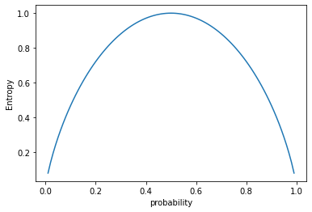

# Decision Tree

> contents：
>
> 1. Concept Introduction
> 2. Theory
> 3. Code


## Concept Introduction

这里首先对涉及到的专有名词进行解释

- Entropy and Purity 熵与纯度

- Information Gain and Information Gain Ratio 信息增益和信息增益率

- Gini Index 基尼系数

- Classification Tree and Regression Tree 分类树和回归树

  

  **Entropy and Purity ** ：

  > Entropy is a measure of uncertainty

  熵表示不确定性，与纯度负相关。比如

  事件A：今天可能下雨；

  事件B：今天不可能下雨；

  事件A的不确定性大于事件B，即E(A) > E (B)

  在数据分析中常采用Shannon entropy，公式如下：

  

  

  P~i~ 表示事件i 发生的概率。其函数图像如下：

  

  在极值点附近的熵值低纯度高，而靠近中间位置的熵值高，纯度低。

  

  **Information Gain and Information Gain Ratio**

  > 纯度提升的指标

  信息增益表示(子)特征信息减少(父)类不确定性的程度。我们先来看一下它的公式：

  =Entropy(A)-\sum_{i=0}^{k}\frac{|A_i|}{|A|}Entropy(a_i))

  从公式中我们可以看到信息增益就是将使用特征a对A进行划分前后的熵值差，这个差值越大表明使用a进行特征化的子类不确定性越小，即纯度越高。

  信息增益率是另一种衡量纯度的指标，其公式如下：

  

  ...

  ## Theory
  
  常见的决策树算法有ID3（采用信息增益），ID4.5（采用信息增益率），CART分类树（采用基尼系数）
  
  ## Code

```python
from sklearn import datasets
from sklearn import tree
from sklearn.tree import DecisionTreeClassifier
from sklearn.tree import DecisionTreeRegressor

datasetsName = load_datasetsName()      #比如 Boston = load_boston()
features = datasetsName.data            #特征值
labels = datasetsName.target            #目标值

#######选择模型###########

#分类树
dtc = tree.DecisionTreeClassifier()     #创建决策树分类器模型  默认为ginii系数
dtc = tree.DecisionTreeClassifier(criterion = 'entropy') #ID3
dtc = dtc.fit(features, labels)         #使用模型进行分析

#回归树
dtr=DecisionTreeRegressor()             # 创建CART回归树
dtr.fit(train_features, train_price)    # 拟合构造CART回归树
```

